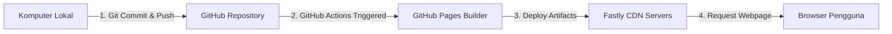

# LAPORAN PROYEK UJIAN AKHIR SEMESTER (UAS)
## MATA KULIAH: CLOUD COMPUTING

### TEMA PROYEK: DEPLOYMENT WEBSITE PORTFOLIO STATIS DENGAN INFRASTRUKTUR GITHUB PAGES

---

**Disusun Oleh:**
*   **Nama:** Wika
*   **NIM:** [Masukkan NIM Anda di Sini]
*   **Kelas:** [Masukkan Kelas Anda di Sini]

**PROGRAM STUDI TEKNOLOGI INFORMASI**
**SEMESTER 4**
**TAHUN 2026**

---

## DAFTAR ISI
1. [BAB I: PENDAHULUAN](#bab-i-pendahuluan)
    *   1.1 Latar Belakang
    *   1.2 Tujuan Proyek
    *   1.3 Tema dan Deskripsi Proyek
2. [BAB II: ARSITEKTUR CLOUD & TEKNOLOGI](#bab-ii-arsitektur-cloud--teknologi)
    *   2.1 Konsep Cloud Hosting Statis
    *   2.2 GitHub Pages sebagai Solusi Serverless Hosting
    *   2.3 Alur Kerja Continuous Deployment (CD)
3. [BAB III: IMPLEMENTASI DESAIN & KODE SUMBER](#bab-iii-implementasi-desain--kode-sumber)
    *   3.1 Sistem Desain (Design Tokens)
    *   3.2 Struktur Halaman (HTML Semantic)
    *   3.3 Interaktivitas Website (JavaScript)
4. [BAB IV: PANDUAN LANGKAH DEPLOYMENT](#bab-iv-panduan-langkah-deployment)
    *   4.1 Inisialisasi Repositori Git Lokal
    *   4.2 Pembuatan Repositori GitHub
    *   4.3 Publikasi ke GitHub Pages
5. [BAB V: PENGUJIAN PEMBARUAN (UPDATE) DAN CONTINUOUS INTEGRATION](#bab-v-pengujian-pembaruan-update-dan-continuous-integration)
    *   5.1 Proses Pembaruan Kode Sumber
    *   5.2 Verifikasi Live Update
6. [BAB VI: KESIMPULAN & SARAN](#bab-vi-kesimpulan--saran)

---

## BAB I: PENDAHULUAN

### 1.1 Latar Belakang
Perkembangan teknologi awan (cloud computing) telah mendefinisikan ulang cara aplikasi web dibangun dan didistribusikan. Dahulu, untuk mempublikasikan website sederhana, seorang developer harus membeli server VPS, mengonfigurasi web server seperti Apache atau Nginx secara manual, menyewa alamat IP publik, serta membeli sertifikat SSL secara terpisah. Proses ini memakan waktu, biaya, dan memerlukan keahlian administrasi sistem yang mendalam.

Kini, dengan kehadiran layanan awan modern berbasis *Serverless Static Web Hosting*, proses deployment dapat disederhanakan secara signifikan. Layanan seperti GitHub Pages memungkinkan developer untuk meng-host kode statis secara langsung dari repositori Git mereka tanpa biaya sepeser pun. Hal ini sangat cocok untuk website profil usaha, dokumentasi, atau portfolio personal yang mengedepankan kecepatan akses, skalabilitas tinggi, keamanan tangguh, dan integrasi yang erat dengan alur kerja pengembangan software.

### 1.2 Tujuan Proyek
Proyek ini dibuat untuk memenuhi persyaratan Ujian Akhir Semester (UAS) mata kuliah Cloud Computing dengan tujuan:
1.  Merancang dan mengimplementasikan website statis interaktif yang responsif dan berestetika tinggi.
2.  Mempraktikkan alur deployment terotomatisasi menggunakan Git dan platform Cloud Hosting berbasis GitHub Pages.
3.  Memahami konsep Continuous Integration / Continuous Deployment (CI/CD) melalui mekanisme pembaruan website otomatis (push-to-deploy).
4.  Menghasilkan materi portfolio profesional yang dapat diakses oleh publik sebagai bukti keahlian teknis.

### 1.3 Tema dan Deskripsi Proyek
Tema yang dipilih adalah **Personal Portfolio Developer**. Website ini dirancang khusus untuk mempublikasikan profil diri, daftar keahlian (*skills*), daftar projek unggulan (termasuk proyek rental motor RideNusa), serta menyediakan formulir kontak bagi pengunjung. Halaman web ini didesain menggunakan paradigma *single-page application* dengan navigasi halus (*smooth scroll*) dan animasi transisi premium untuk kenyamanan pengguna.

---

## BAB II: ARSITEKTUR CLOUD & TEKNOLOGI

### 2.1 Konsep Cloud Hosting Statis
Hosting statis di cloud berarti menyajikan file HTML, CSS, JavaScript, dan media (gambar/video) secara langsung dari sistem penyimpanan awan terdistribusi tanpa adanya server backend aktif yang memproses logika basis data setiap kali ada permintaan. 

Ketika pengguna mengakses URL website, server cloud hanya perlu mengirimkan file statis yang telah jadi. Keuntungan dari metode ini mencakup:
*   **Kecepatan Luar Biasa**: Waktu muat (load time) sangat cepat karena tidak ada pemrosesan database di sisi server.
*   **Skalabilitas Tinggi**: Server statis dapat melayani jutaan permintaan bersamaan tanpa mengalami kelebihan beban (*overload*).
*   **Keamanan Kuat**: Tidak ada celah SQL Injection atau kerentanan backend karena tidak ada database dinamis yang terhubung langsung.

### 2.2 GitHub Pages sebagai Solusi Serverless Hosting
GitHub Pages adalah layanan hosting publik gratis yang disediakan oleh GitHub untuk menyajikan halaman web langsung dari repositori GitHub milik pengguna. 



Dibalik layar, GitHub Pages menggunakan arsitektur serverless yang terintegrasi dengan CDN (Content Delivery Network) Fastly. Setiap kali repositori diperbarui, GitHub secara otomatis memproses file, mengompresinya, mendistribusikannya ke edge server di seluruh dunia, dan menyediakan enkripsi SSL/HTTPS secara gratis.

### 2.3 Alur Kerja Continuous Deployment (CD)
Alur kerja dalam proyek ini menerapkan prinsip *GitOps*, di mana repositori Git bertindak sebagai satu-satunya sumber kebenaran (*single source of truth*).
1.  **Tahap Development**: Perubahan kode dilakukan secara lokal di komputer pengembang.
2.  **Tahap Push**: Kode di-push ke branch utama (`main`) di GitHub.
3.  **Tahap Trigger**: GitHub mendeteksi adanya push baru dan memicu alur kerja otomatis (GitHub Actions workflow).
4.  **Tahap Deploy**: File statis didistribusikan ke server hosting GitHub Pages dan diperbarui secara instan di URL publik.

---

## BAB III: IMPLEMENTASI DESAIN & KODE SUMBER

### 3.1 Sistem Desain (Design Tokens)
Website ini mengimplementasikan panduan desain modern dalam berkas `style.css` dengan parameter berikut:
*   **Tema Warna**: Eksklusif Dark Mode untuk tampilan profesional dan nyaman di mata.
    *   Latar Belakang: Near-black (`#0a0a0a`)
    *   Warna Aksen: Indigo (`#6366f1`) dan Rose-Red (`#f43f5e`)
    *   Kartu: Semi-transparan (`rgba(255, 255, 255, 0.03)`) dengan border super tipis (`rgba(255, 255, 255, 0.05)`) yang bersinar saat di-hover.
*   **Tipografi**: Menggunakan font tunggal **Inter** yang diimpor dari Google Fonts dengan ukuran teks terstruktur secara hierarkis.

### 3.2 Struktur Halaman (HTML Semantic)
Untuk menjaga aksesibilitas (A11y) dan keramahan mesin pencari (SEO), struktur dokumen `index.html` ditulis dengan elemen semantik HTML5:
*   `<nav>` untuk navigasi utama dengan tinggi tetap (h-16), dilengkapi backdrop blur.
*   `<main>` dengan atribut ID `main-content` sebagai kontainer konten inti.
*   `<section>` terpisah untuk setiap bagian: **Beranda**, **Profil**, **Projek** (Informasi Utama), dan **Kontak**.
*   `<article>` untuk membungkus kartu projek secara mandiri.
*   `<footer>` untuk hak cipta dan navigasi sekunder.

### 3.3 Interaktivitas Website (JavaScript)
Berkas `script.js` bertanggung jawab atas tiga fitur utama:
1.  **Scroll Spy**: Secara otomatis mendeteksi posisi scroll pengguna dan memberikan kelas `.active` pada navigasi yang sesuai.
2.  **Responsive Hamburger Menu**: Memungkinkan pengguna perangkat seluler membuka dan menutup navigasi samping secara interaktif.
3.  **Contact Form Validation**: Memvalidasi formulir kontak sebelum submit dan menampilkan modal pop-up kustom yang menandakan pesan sukses terkirim.

---

## BAB IV: PANDUAN LANGKAH DEPLOYMENT

Berikut adalah panduan teknis deployment website ke GitHub Pages:

1.  **Inisialisasi Repositori Git Lokal**:
    Jalankan perintah berikut di direktori proyek lokal Anda:
    ```bash
    git init
    git add .
    git commit -m "Initial commit: website portfolio v1"
    ```
2.  **Membuat Repositori Baru di GitHub**:
    *   Buka [GitHub](https://github.com) dan buat repositori publik baru bernama `portfolio-uas`.
    *   Biarkan repositori kosong tanpa file README atau `.gitignore`.
3.  **Hubungkan Repositori Lokal dengan GitHub**:
    Ganti URL di bawah dengan tautan repositori GitHub Anda:
    ```bash
    git remote add origin https://github.com/sastrawanwika/portfolio-uas.git
    git branch -M main
    git push -u origin main
    ```
4.  **Konfigurasi GitHub Pages**:
    *   Masuk ke menu **Settings** pada halaman repositori GitHub Anda.
    *   Klik menu **Pages** di kolom sebelah kiri.
    *   Pada bagian *Build and deployment*, atur Source menjadi **Deploy from a branch**.
    *   Atur Branch ke **main** dan folder ke **/(root)**, lalu klik **Save**.
    *   Tunggu proses build selesai. Halaman Anda akan online di `https://sastrawanwika.github.io/portfolio-uas/`.

---

## BAB V: PENGUJIAN PEMBARUAN (UPDATE) DAN CONTINUOUS INTEGRATION

### 5.1 Proses Pembaruan Kode Sumber
Untuk memenuhi persyaratan pembaruan website setelah deployment pertama, dilakukan modifikasi kecil pada data keahlian atau deskripsi di file `index.html`. 

Sebagai contoh, ditambahkan tag skill baru pada kategori web development (misal: "Next.js" atau "TypeScript") di dalam file `index.html` seperti contoh diff berikut:
```diff
 <div class="skills-list">
   <span class="tag">HTML5 & CSS3</span>
   <span class="tag">JavaScript (ES6+)</span>
   <span class="tag">Laravel (PHP)</span>
+  <span class="tag">TypeScript</span>
+  <span class="tag">Next.js</span>
 </div>
```

### 5.2 Verifikasi Live Update
Setelah file disimpan, pengembang melakukan push kembali ke repositori GitHub:
```bash
git add .
git commit -m "Update: menambahkan skill TypeScript dan Next.js"
git push origin main
```
Dalam beberapa detik, server GitHub Actions memproses commit baru ini. Halaman web di URL publik secara otomatis terperbarui tanpa intervensi manual tambahan. Hal ini membuktikan bahwa alur kerja pengiriman berkelanjutan (Continuous Deployment) berjalan dengan sukses dan real-time.

---

## BAB VI: KESIMPULAN & SARAN

### 6.1 Kesimpulan
1.  Deployment website statis dengan GitHub Pages terbukti sangat efisien, cepat, dan mudah diimplementasikan untuk kebutuhan hosting non-database.
2.  Integrasi erat antara Git repositori lokal dan platform cloud GitHub Pages memungkinkan otomatisasi penuh pada siklus pembaruan konten (Continuous Deployment).
3.  Desain responsif berbasis dark mode dengan paduan warna indigo-rose memberikan pengalaman visual yang profesional dan premium bagi pengunjung.

### 6.2 Saran
*   Untuk pengembangan lebih lanjut, disarankan menambahkan custom domain untuk profesionalisme identitas web.
*   Integrasikan tools analisis kinerja website seperti Google Analytics atau Lighthouse audit secara teratur untuk memonitor metrik kecepatan dan SEO.
