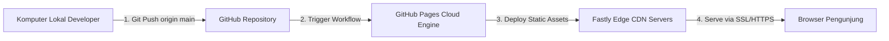

# LAPORAN PROYEK UJIAN AKHIR SEMESTER (UAS)
## MATA KULIAH: CLOUD COMPUTING

### TEMA PROYEK: DEPLOYMENT WEBSITE PORTFOLIO STATIS INTERAKTIF BERBASIS INFRASTRUKTUR CLOUD GITHUB PAGES
**URL Live Website**: [https://baconhairboi123.github.io/UAS_CloudComputing.github.io/](https://baconhairboi123.github.io/UAS_CloudComputing.github.io/)

---

**Disusun Oleh:**
* **Nama:** Wika
* **NIM:** [Masukkan NIM Anda di Sini]
* **Kelas:** [Masukkan Kelas Anda di Sini]

**PROGRAM STUDI TEKNOLOGI INFORMASI**  
**SEMESTER 4**  
**TAHUN 2026**

---

## DAFTAR ISI
1. [BAB I: PENDAHULUAN](#bab-i-pendahuluan)
    * 1.1 Latar Belakang & Rasionalisasi Pemilihan Proyek
    * 1.2 Mengapa Memilih Portfolio Statis dibanding Infrastruktur Cloud Backend Murni?
    * 1.3 Tujuan Proyek
    * 1.4 Tema dan Deskripsi Proyek
2. [BAB II: ARSITEKTUR CLOUD & TEKNOLOGI](#bab-ii-arsitektur-cloud--teknologi)
    * 2.1 Konsep Cloud Hosting Statis & Serverless Edge Computing
    * 2.2 GitHub Pages & Integration dengan Fastly CDN
    * 2.3 Alur Kerja Continuous Deployment (CD) & GitOps
3. [BAB III: IMPLEMENTASI DESAIN & INTERAKTIVITAS KOSMIK](#bab-iii-implementasi-desain--interaktivitas-kosmik)
    * 3.1 Sistem Desain Kosmik (Design Tokens & Color Palette)
    * 3.2 3D Warp Starfield & Fitur Interaktif Multi-Klik Logo (Rocket, Supernova, Gargantua)
    * 3.3 Sistem Paginasi Dinamis Projek Unggulan
    * 3.4 Fitur Audio Ambient Space & Web Audio Synth Fallback
4. [BAB IV: PANDUAN LANGKAH DEPLOYMENT CLOUD](#bab-iv-panduan-langkah-deployment-cloud)
    * 4.1 Inisialisasi Repositori Git Lokal
    * 4.2 Hubungkan ke GitHub Remote Repository
    * 4.3 Konfigurasi GitHub Pages Engine
5. [BAB V: PENGUJIAN CONTINUOUS DEPLOYMENT (CD) & VERIFIKASI LIVE](#bab-v-pengujian-continuous-deployment-cd--verifikasi-live)
    * 5.1 Proses Pembaruan Kode Sumber
    * 5.2 Verifikasi Live Update Terotomatisasi
6. [BAB VI: KESIMPULAN & SARAN](#bab-vi-kesimpulan--saran)

---

## BAB I: PENDAHULUAN

### 1.1 Latar Belakang
Perkembangan teknologi awan (*cloud computing*) telah mendefinisikan ulang cara aplikasi web modern dibangun dan didistribusikan. Dahulu, untuk mempublikasikan sebuah aplikasi atau website, seorang developer harus membeli server VPS, mengonfigurasi web server seperti Apache atau Nginx secara manual, mengelola sertifikat SSL, serta memelihara patch keamanan server secara berkala.

Kini, dengan kehadiran layanan awan modern berbasis *Serverless Static Web Hosting* dan *Edge Network CDN*, pengembang dapat langsung meng-host aplikasi dari repositori Git tanpa harus mengelola server fisik atau virtual (*No Ops / Serverless*). Layanan seperti GitHub Pages memungkinkan publikasi instan dengan kecepatan akses tinggi, skalabilitas tanpa batas, serta otomatisasi Continuous Deployment (CD).

### 1.2 Mengapa Memilih Portfolio Statis dibanding Infrastruktur Cloud Backend Murni?
Dalam penyusunan proyek UAS Cloud Computing ini, timbul pertanyaan esensial: **Mengapa memilih membangun website portfolio statis daripada menyewa VPS/cloud backend murni yang kompleks?**

Berikut adalah pertimbangan teknis dan praktis di baliknya:

1. **Penerapan Konsep *Serverless Cloud Computing* yang Efisien**:
   - Cloud Computing tidak hanya sebatas menyewa server virtual (IaaS). Tren industri modern justru mengarah pada *Serverless* dan *PaaS/SaaS*. 
   - Menggunakan GitHub Pages mendemonstrasikan pemahaman tentang pemanfaatan **Infrastruktur Cloud Publik Terdistribusi** berbasis Content Delivery Network (CDN) Fastly secara maksimal tanpa pemborosan sumber daya (*cost-effective & zero-maintenance cloud*).

2. **Fleksibilitas Continuous Deployment (CI/CD) Real-World**:
   - Proyek portfolio ini terintegrasi penuh dengan alur kerja **GitOps & GitHub Actions**. Setiap kali ada perubahan pada file proyek di lokal yang di-push ke branch `main`, infrastruktur awan GitHub secara otomatis memicu proses *build*, *packaging*, dan *deployment* ke edge server global hanya dalam beberapa detik.

3. **Produk Nyata (Real-World Value & High Impact)**:
   - Membuat infrastruktur server dummy tanpa aplikasi konkret sering kali kurang memberikan nilai guna jangka panjang.
   - Dengan membangun **Website Personal Portfolio**, hasil proyek ini menjadi aset profesional yang nyata yang dapat diakses publik kapan saja, serta bertindak sebagai pusat etalase untuk memamerkan seluruh proyek-proyek IT lainnya (seperti sistem RideNusa berbasis Laravel/MySQL dan Hello World).

4. **Keamanan Maksimal (Zero Attack Surface)**:
   - Website statis di cloud memiliki tingkat keamanan tertinggi (*Zero Server Vulnerability*) karena tidak memiliki database dinamis yang rentan terhadap serangan SQL Injection, Remote Code Execution (RCE), atau kebocoran kredensial server.

### 1.3 Tujuan Proyek
Proyek ini dibuat untuk memenuhi persyaratan Ujian Akhir Semester (UAS) mata kuliah Cloud Computing dengan tujuan:
1. Merancang dan mengimplementasikan website statis interaktif yang responsif, berestetika tinggi, dan kaya fitur interaktif.
2. Mempraktikkan alur deployment terotomatisasi menggunakan Git dan platform Cloud Hosting berbasis GitHub Pages.
3. Memahami konsep Continuous Integration / Continuous Deployment (CI/CD) melalui mekanisme pembaruan website otomatis (*push-to-deploy*).
4. Menghasilkan materi portfolio profesional yang dapat diakses oleh publik sebagai bukti keahlian teknis.

### 1.4 Tema dan Deskripsi Proyek
Tema yang dipilih adalah **Personal Portfolio IT Developer (Dark Mode Cosmic Theme)**. Website ini dirancang khusus untuk mempublikasikan profil diri sebagai pengembang software, daftar keahlian (*skills*), daftar projek unggulan (RideNusa Web, Hello World, RideNusa Mobile, KRS Touhou Indonesia, dan Coming Soon Card), pemutar audio ambient luar angkasa, serta efek visual interaktif kosmik (Rocket Launch, Supernova Warp, dan Gargantua Black Hole Implosion).

---

## BAB II: ARSITEKTUR CLOUD & TEKNOLOGI

### 2.1 Konsep Cloud Hosting Statis & Serverless Edge Computing
Hosting statis di cloud berarti menyajikan file HTML, CSS, JavaScript, dan media secara langsung dari sistem penyimpanan awan terdistribusi (*distributed object storage*) tanpa adanya server backend aktif yang memproses permintaan HTTP dinamis.

Keuntungan utama dari arsitektur ini:
* **Kecepatan Luar Biasa**: Waktu muat (load time) mendekati instan karena tidak ada query database atau kompilasi server-side.
* **Skalabilitas Tanpa Batas**: Server CDN cloud dapat melayani jutaan pengguna bersamaan tanpa lonjakan beban server (*zero crash*).
* **Performa Terdistribusi Global**: File disimpan di *edge locations* yang terdekat dengan posisi geografis pengguna.

### 2.2 GitHub Pages & Integration dengan Fastly CDN
GitHub Pages menggunakan arsitektur serverless yang terintegrasi dengan CDN (Content Delivery Network) Fastly.



### 2.3 Alur Kerja Continuous Deployment (CD) & GitOps
Alur kerja dalam proyek ini menerapkan prinsip *GitOps*:
1. **Development**: Pengkodean dan pengujian dilakukan secara lokal.
2. **Push**: Kode di-push ke repositori GitHub pada branch `main`.
3. **Automated Deployment**: Cloud runner GitHub Pages menangkap commit baru dan memperbarui live site secara otomatis dalam hitungan detik.

---

## BAB III: IMPLEMENTASI DESAIN & INTERAKTIVITAS KOSMIK

### 3.1 Sistem Desain Kosmik (Design Tokens & Color Palette)
Website mengusung estetika **Sleek Dark Mode Space Theme**:
* **Warna Utama**: Deep Space Black (`#04030d`), Neon Indigo (`#6366f1`), Violet (`#a855f7`), RideNusa Gold (`#FFB51D`), dan Cyan (`#38bdf8`).
* **Tipografi**: Google Fonts **Inter** dengan pembacaan terstruktur dan kontras tinggi.
* **Layout Keahlian (My Skills)**: Didesain kompak 6 kolom pada tampilan desktop untuk visibilitas maksimal dalam sekali pandang.

### 3.2 3D Warp Starfield & Fitur Interaktif Multi-Klik Logo
Salah satu keunggulan utama website ini adalah sistem latar belakang **3D Warp Starfield** yang memuat lebih dari 1200+ bintang 3D terdistribusi secara seimbang di 4 kuadran layar (*Top-Left, Bottom-Left, Top-Right, Bottom-Right*).

Logo `wika.dev` dilengkapi dengan logika hitungan klik interaktif presisi:
1. **1x Klik (Rocket Orbit 🚀)**: Memutar logo dan meluncurkan roket luar angkasa dengan jejak percikan bintang melayang.
2. **2x Klik (Supernova Hyperspace Warp ✨)**: Pemicuan jeda responsif 380ms yang memicu ledakan cahaya Supernova pada logo dan meluncurkan bintang-bintang di latar belakang dalam kecepatan warp cahaya.
3. **3x Klik (Gargantua Black Hole Implosion 🕳️)**: Pemicuan instan objek Lubang Hitam Raksasa (Gargantua) di tengah logo yang secara bertahap menyedot dan memutar seluruh elemen teks, kartu projek, dan navigasi website secara 3D sebelum meledak kembali normal.

### 3.3 Sistem Paginasi Dinamis Projek Unggulan
Di bagian **Highlight Projects**, diimplementasikan sistem paginasi dinamis berbasis JavaScript (`< 1 2 >`):
* **Halaman 1**: Menampilkan 4 projek unggulan (RideNusa Web, Hello World, RideNusa Mobile, dan KRS Universitas Touhou Indonesia).
* **Halaman 2**: Menampilkan kartu projek ke-5 (*Coming Soon Card*).
* Sistem paginasi berjalan secara mulus tanpa melakukan reload halaman penuh.

### 3.4 Fitur Audio Ambient Space & Web Audio Synth Fallback
Website dilengkapi dengan tombol pemutar audio ambient luar angkasa (`#audio-toggle`). Apabila file audio eksternal tidak dapat dimuat, sistem secara otomatis beralih menggunakan **Web Audio API Synthesizer Fallback** kustom yang menghasilkan frekuensi suara khas luar angkasa secara sintetis.

---

## BAB IV: PANDUAN LANGKAH DEPLOYMENT CLOUD

1. **Inisialisasi Repositori Git Lokal**:
   ```bash
   git init
   git add .
   git commit -m "Initial commit: website portfolio v1"
   ```

2. **Menghubungkan ke Repositori GitHub**:
   ```bash
   git remote add origin https://github.com/BaconHairBoi123/UAS_CloudComputing.github.io.git
   git branch -M main
   git push -u origin main
   ```

3. **Pengaktifan GitHub Pages**:
   - Masuk ke **Settings** -> **Pages** pada repositori GitHub.
   - Pada bagian *Source*, pilih **Deploy from a branch**.
   - Atur Branch ke **main** dan folder ke **/(root)**, lalu simpan.
   - Website live di URL: `https://baconhairboi123.github.io/UAS_CloudComputing.github.io/`.

---

## BAB V: PENGUJIAN CONTINUOUS DEPLOYMENT (CD) & VERIFIKASI LIVE

### 5.1 Proses Pembaruan Kode Sumber
Untuk membuktikan Continuous Deployment (CD), dilakukan pembaruan kode di lokal berupa penambahan projek ke-5 (*Coming Soon Card*) beserta sistem paginasi dinamis JavaScript.

### 5.2 Verifikasi Live Update Terotomatisasi
Setelah file disimpan, pengembang melakukan push kembali ke GitHub:
```bash
git add .
git commit -m "Update: menambahkan sistem paginasi projek dan projek ke-5 coming soon"
git push origin main
```
Dalam beberapa detik, GitHub Pages Cloud Engine mendeteksi commit baru ini, membangun ulang aplikasi, dan memperbarui tampilan website publik di URL live secara otomatis tanpa perlu tindakan manual di server.

---

## BAB VI: KESIMPULAN & SARAN

### 6.1 Kesimpulan
1. Pemilihan website portfolio statis interaktif berbasis GitHub Pages mendemonstrasikan penerapan konsep **Serverless Cloud Computing** yang sangat efisien, aman, cepat, dan hemat biaya.
2. Otomatisasi deployment berbasis GitOps/GitHub Actions terbukti mempermudah alur pengiriman Continuous Deployment (CD).
3. Penggunaan fitur interaktif kosmik 3D, paginasi dinamis, dan pemutar audio ambient menciptakan nilai estetika yang tinggi dan profesional bagi pengunjung.

### 6.2 Saran
* Menambahkan *custom domain* (.id atau .dev) untuk meningkatkan identitas profesional.
* Mengintegrasikan alat pemantauan analisis kinerja awan seperti Google Lighthouse untuk memonitor metrik kecepatan dan SEO secara teratur.
